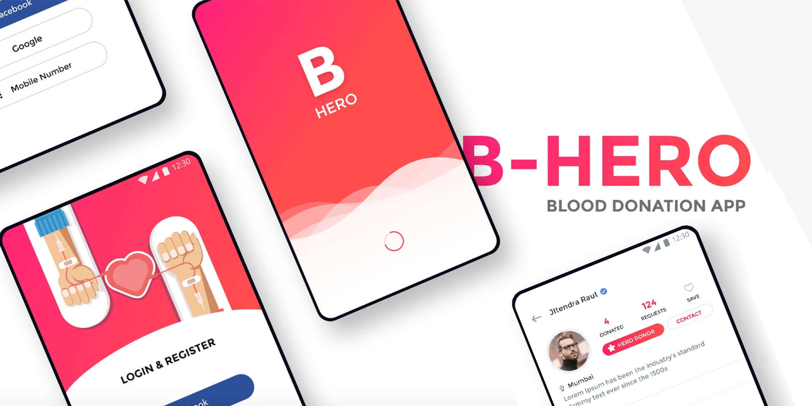

# B-HERO app
an open source and free blood donation app made with Vue js and Vuetify
sposored by [NextGN](https://nextgn.dev/)



# Todo list

check [project](https://github.com/moh-slimani/b-hero/projects/1)


## Design files
original design by Jitu Raut [here](https://uibundle.com/products/b-hero-blood-donation-app-free-ui-kit)

[XD link for developers](https://xd.adobe.com/view/b7d22547-8382-4973-769d-659d40c080ae-c1e3/grid)
 
## backend project

> not started yet

## Project setup
```
yarn install
yarn serve
yarn build
yarn lint
```

### Customize configuration
See [Configuration Reference](https://cli.vuejs.org/config/).
